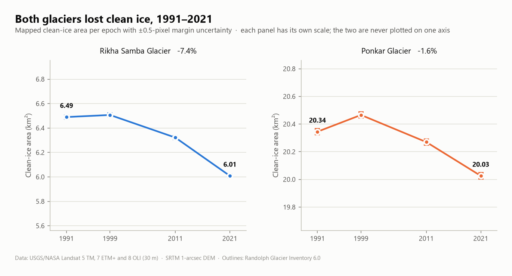
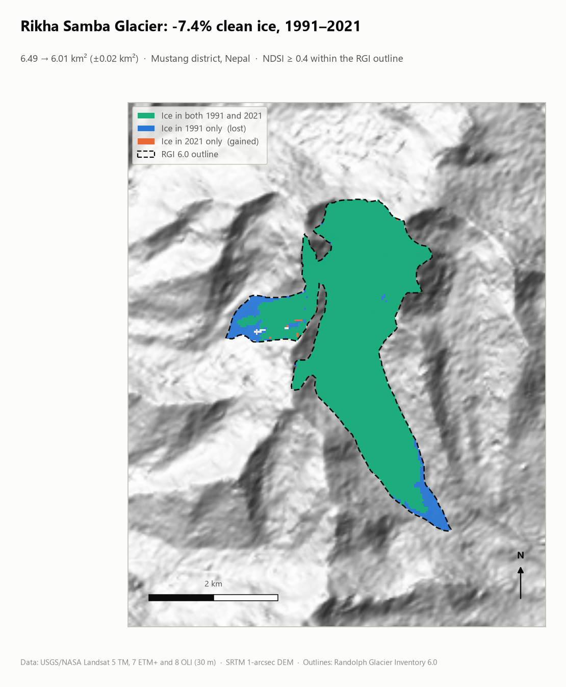
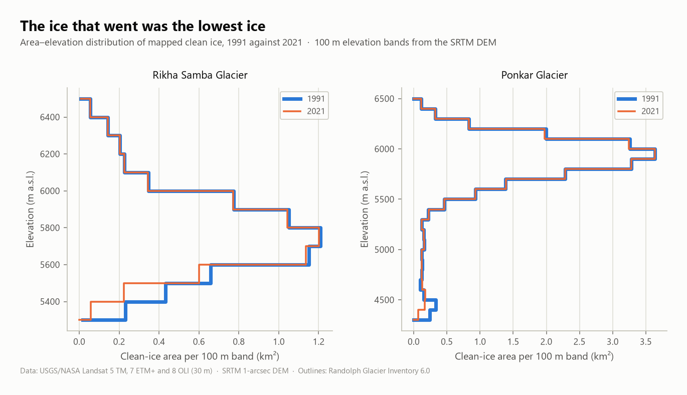
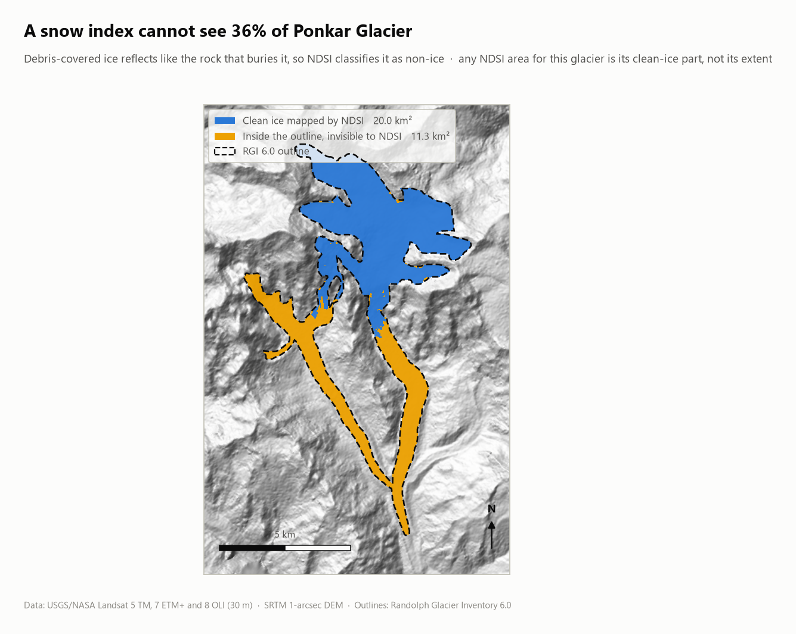
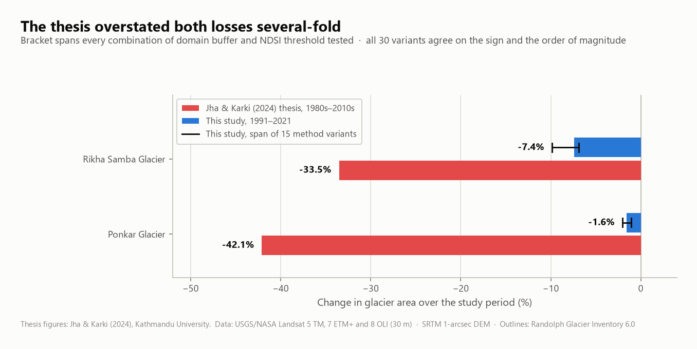

# Glacier Change in the Nepal Himalaya — Rikha Samba & Ponkar

Reproducible remote-sensing analysis of two Nepalese glaciers over thirty
years, from public Landsat and SRTM archives. Every number, map and chart in
this repository is produced by the six scripts in `src/`, from data that is
downloaded on demand — nothing is hand-digitised and nothing is carried over
from a spreadsheet.

**Rikha Samba Glacier** (Mustang) and **Ponkar Glacier** (Manang) are mapped in
four mid-October epochs — 1991, 1999, 2011 and 2021 — from a single Landsat
footprint that covers them both, so the two are always compared under identical
acquisition conditions.

---

## Headline results

| | Rikha Samba | Ponkar |
|---|---|---|
| RGI 6.0 ID | `RGI60-15.04847` | `RGI60-15.04541` |
| Inventory area | 6.504 km² | 31.267 km² |
| Clean ice, 1991 | **6.49 km²** | **20.35 km²** |
| Clean ice, 2021 | **6.01 km²** | **20.03 km²** |
| Change | **−0.48 km² (−7.4 %)** | **−0.32 km² (−1.6 %)** |
| Uncertainty on the change | ±0.02 km² | ±0.03 km² |
| Across 15 method variants | −6.9 % to −9.9 % | −1.1 % to −2.1 % |
| Lower limit of clean ice | **rose 97 m** | **rose 221 m** |
| Debris-covered fraction | none | **36 % of the glacier** |

Both glaciers lost clean ice, and every one of the 30 method configurations
tested agrees on the sign. But the two are losing it differently. Rikha Samba,
a clean-ice glacier, shrank measurably at its terminus and its western
tributary. Ponkar barely changed in clean-ice *area* while its clean ice climbed
**221 m** upslope — the ice is not so much disappearing as migrating up, with
the debris-covered tongue below it invisible to any snow index.

<picture>
  <source media="(prefers-color-scheme: dark)" srcset="outputs/maps/area-change-dark.png">
  
</picture>

## Where the ice went

<picture>
  <source media="(prefers-color-scheme: dark)" srcset="outputs/maps/extent-rikha-samba-dark.png">
  
</picture>

Loss is concentrated at the snout and along the western tributary — the lowest,
warmest ice — while the accumulation basin is unchanged. The hypsometry says the
same thing numerically: the two epochs' area–elevation curves are
indistinguishable above about 5,600 m and separate only below it.

<picture>
  <source media="(prefers-color-scheme: dark)" srcset="outputs/maps/hypsometry-dark.png">
  
</picture>

## What a snow index cannot do

<picture>
  <source media="(prefers-color-scheme: dark)" srcset="outputs/maps/debris-cover-dark.png">
  
</picture>

Debris-covered ice reflects like the rock burying it, so **no snow index can
map it**. On Ponkar that is 11.3 km² — 36 % of the glacier — and it is exactly
the two long tongues in the lower valleys. Any NDSI-derived area for this
glacier is its clean-ice part, not its extent, and this repository labels it as
such throughout. Measuring Ponkar's real extent needs a thermal or
morphometric method, or manual delineation; that is outside what this pipeline
claims to do.

## Validation

The method is checked against published extents rather than asserted:

| Glacier | Reference | Reference area | This study | Difference |
|---|---|---|---|---|
| Rikha Samba | RGI 6.0, nominal 2000 | 6.504 km² | 6.507 km² (1999) | **+0.05 %** |
| Ponkar | RGI 6.0, nominal 2000 | 31.267 km² | 20.466 km² (1999) | −34.5 % *(clean ice only)* |
| Ponkar | Thapa (2019) | 28.509 km² | 20.026 km² (2021) | −29.8 % *(clean ice only)* |

Rikha Samba lands within 0.05 % of the inventory area for the matching date,
from a different image and an independent classification. The Ponkar gaps are
not error — they are the debris-covered fraction, and they agree with each
other.

Terrain statistics derived here also reproduce the inventory: elevation range
5375–6515 m against RGI's 5380–6513 m for Rikha Samba, and 3736–6509 m against
3734–6508 m for Ponkar, with mean aspect south in both cases.

## Relationship to the 2024 thesis

This pipeline re-derives the area analysis of *"Study of Glacier Dynamics in
Rikha Samba Glacier, Mustang, and Ponkar Glacier, Manang in Relation to Climate
Change"* (Jha & Karki, Kathmandu University, 2024), after the original working
data was lost. It reaches substantially smaller numbers.

<picture>
  <source media="(prefers-color-scheme: dark)" srcset="outputs/maps/method-comparison-dark.png">
  
</picture>

Three differences account for most of the gap, and each is a methodological fix
rather than a matter of opinion:

1. **NDSI band choice.** NDSI is `(green − SWIR) / (green + SWIR)`. The thesis
   states `(green − red) / (green + red)`, which does not separate snow from
   bright bare rock.
2. **Scene seasonality.** The thesis's 1980s Ponkar area of 49.2 km² falls to
   29.8 km² in the next decade and then barely moves, which is the signature of
   seasonal snow in one early scene rather than forty years of retreat. Every
   scene here is mid-October, when seasonal snow is at its annual minimum.
3. **Volume.** The thesis computes volume as area × a DEM elevation, which does
   not estimate ice volume. This uses volume–area scaling (Bahr et al. 1997,
   2015) and reports it with its ±30 % uncertainty.

The thesis conclusions about the *direction* of change hold — both glaciers are
losing ice, and the lowest ice is going first. The magnitudes do not.

## Reproducing it

```bash
pip install -r requirements.txt

python src/fetch_rgi.py        # glacier outlines from the RGI archive
python src/fetch_imagery.py    # Landsat windows + SRTM tiles
python src/delineate.py        # NDSI classification, areas, uncertainty
python src/validate.py         # sensitivity grid + published-extent comparison
python src/terrain.py          # slope, aspect, hypsometry
python src/make_figures.py     # maps and charts, light and dark
```

The first two steps need network access; the rest run offline against the
committed clips. No account or API key is required for any archive used here.
The whole pipeline runs in a couple of minutes.

## Method notes

- **Scene selection.** WRS-2 path 142 / row 040 covers both glaciers. Scenes are
  Tier 1 (terrain-corrected), acquired in October or November, lowest available
  cloud, and no Landsat 7 after the 2003 scan-line-corrector failure. The four
  chosen are all mid-October with ≤3 % cloud.
- **Radiometry.** Digital numbers are converted to top-of-atmosphere reflectance
  with each scene's own rescaling coefficients and corrected for solar
  elevation, which is what makes an index comparable across TM, ETM+ and OLI.
- **Classification.** NDSI ≥ 0.40 with a near-infrared floor of 0.11 to reject
  water and deep shadow, confined to the RGI outline, reduced to the connected
  body overlapping that outline.
- **Domain.** Growing the outline was tried and rejected: both glaciers sit in
  connected ice, and a buffer of a few hundred metres bridges the divide onto
  neighbours. `outputs/tables/sensitivity.csv` records what every buffer does.
  Absolute area depends on this choice; the relative change barely does.
- **Uncertainty.** A half-pixel positional error along the mapped margin, summed
  in quadrature over the boundary pixels — the standard treatment for a
  pixel-based glacier outline.
- **Cartography.** Sequential ramps are single-hue with monotonic lightness;
  categorical colours are validated for protanopia, deuteranopia and tritanopia.
  Every figure renders for a light and a dark surface.

## Repository layout

```
data/
  *_rgi.geojson            glacier outlines from RGI 6.0 (committed)
  scenes/                  Landsat TOA-reflectance clips, 8 stacks (committed)
  masks/                   classified clean-ice masks per epoch (committed)
  rgi/, dem/               fetched on demand, not committed
docs/
  glacier-identification.md  how each glacier was matched to an RGI entry
src/
  config.py                study design: glaciers, scenes, thresholds
  geo.py                   masking, domains, area and uncertainty
  fetch_rgi.py             step 1
  fetch_imagery.py         step 2
  delineate.py             step 3
  validate.py              step 4
  terrain.py               step 5
  make_figures.py          step 6
  viz_theme.py             palette and figure styling
outputs/
  maps/                    figures, light and dark
  tables/                  CSV and JSON results
```

## Limitations

- **Clean ice only.** NDSI maps clean ice. On Ponkar that is 64 % of the
  glacier; the rest is debris-covered and unmeasured here.
- **Four snapshots, not a time series.** Each epoch is one image. Interannual
  variability between them is unresolved, and a single scene always carries some
  seasonal snow that no index separates from glacier ice.
- **Volume is scaled, not measured.** Volume–area scaling gives a
  population-level relationship applied to an individual glacier, which carries
  roughly ±30 %. It is not a substitute for ice-thickness data.
- **No velocity.** The thesis's Sentinel-1 velocity work is not reproduced here;
  it needs SAR products and a SNAP processing chain outside this pipeline's
  scope.
- **No climate attribution.** This repository measures what changed, not why. A
  causal link to warming needs a longer and closer climate record than the
  glaciers' own outlines can supply.

## Data sources

- **Landsat 5 TM, 7 ETM+, 8 OLI** — USGS/NASA, Collection 1 Level-1, via the
  Google Cloud public Landsat archive.
- **SRTM 1-arcsec DEM** — NASA/USGS, via the public elevation-tiles mirror.
- **RGI Consortium (2017).** *Randolph Glacier Inventory 6.0.* Global Land Ice
  Measurements from Space, Boulder, Colorado. DOI: 10.7265/N5-RGI-60.
- **Bahr, D. B., Meier, M. F. & Peckham, S. D. (1997).** "The physical basis of
  glacier volume–area scaling." *JGR Solid Earth* 102(B9): 20355–20362.
- **Bahr, D. B., Pfeffer, W. T. & Kaser, G. (2015).** "A review of volume–area
  scaling of glaciers." *Reviews of Geophysics* 53(1): 95–140.
- **Hall, D. K., Riggs, G. A. & Salomonson, V. V. (1995).** "Development of
  methods for mapping global snow cover using MODIS data." *Remote Sensing of
  Environment* 54(2): 127–140.

## Authors

- **Shristi Karki** — analysis and pipeline
- **Swati Jha** — contributor

The underlying fieldwork and original study were carried out jointly for a
bachelor's thesis at Kathmandu University under Prof. Dr. Rijan Bhakta
Kayastha. When citing the thesis itself, use its title-page byline:
Jha, S. & Karki, S. (2024).

## Licence

Code released under the [MIT Licence](LICENSE). Landsat and SRTM are in the
public domain; RGI 6.0 is released under CC BY 4.0 — cite it if you reuse the
outlines or anything derived from them.
